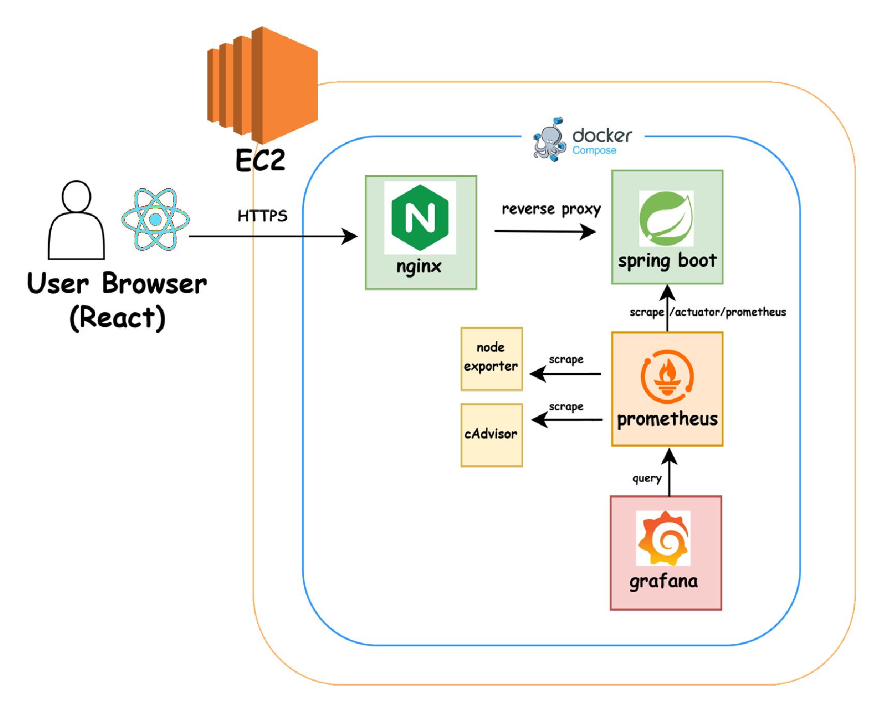
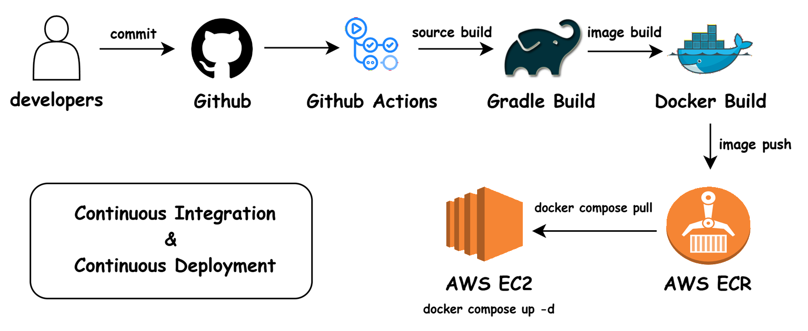

# 🪢 아홉수 환생: 구천 어르신이 풀어주는 사주 살풀이

> **멋쟁이사자처럼 인천대학교 14기 누에고치 팀 프로젝트 (백엔드)**
> 

## 🌐 Deployment

👉 **서비스 URL:** [https://www.9su.site](https://www.9su.site)
👉 **프론트엔드 레포:** [14th-nue-collab-frontend](https://github.com/LikeLionUniv-INU/14th-nue-collab-frontend)

---

## 🛠 Tech Stack

### Backend


### Infra & CI/CD


### Monitoring & Testing


---

## 🏗 서비스 구조



---

## ✨ 신살 분석 로직

생년월일로부터 연주/월주/일주(三柱)를 계산하고, 천간(天干)과 지지(地支)의 관계를 기반으로 **15종의 신살**을 탐지합니다.

**길신 (8종)** — 천을귀인, 천덕귀인, 월덕귀인, 문창귀인, 학당귀인, 금여록, 화개살, 역마살

**흉신 (7종)** — 도화살, 공망, 원진살, 귀문관살, 양인살, 백호살, 고숙살

- 결과는 최대 **6개**까지 반환 (길신/흉신 교대 추출)
- 해당하는 신살이 없으면 **기본 신살** 반환
- 각 신살에 대한 설명, 영향, 조언, 명언 포함

---

## 📡 API

### `GET /api/sinsals?birthDate=2002-04-12`

**정상 응답 (200)**
```json
{
  "birthDate": "2002-04-12",
  "totalCount": 3,
  "sinSals": [
    {
      "key": "cheon_eul_gwi_in",
      "name": "천을귀인",
      "hanja": "天乙貴人",
      "type": "lucky",
      "description": "...",
      "effects": ["..."],
      "advice": ["..."],
      "quote": "..."
    }
  ]
}
```

**에러 응답 (400)**
```json
{
  "code": "SINSAL_002",
  "message": "생년월일 형식이 올바르지 않습니다. (예: 2002-04-12)"
}
```

| 에러 코드 | 설명 |
|----------|------|
| SINSAL_001 | 생년월일은 필수입니다 |
| SINSAL_002 | 생년월일 형식이 올바르지 않습니다 |
| SINSAL_003 | 생년월일은 과거 날짜여야 합니다 |
| SINSAL_500 | 서버 내부 오류가 발생했습니다 |

---

## 🔄 CI/CD 파이프라인



- **CI**: PR 생성 시 `./gradlew build` (빌드 + 단위 테스트)
- **CD**: develop push 시 Docker 이미지 빌드 → ECR push → EC2에서 `docker compose up -d`

---

## 📊 모니터링

Prometheus + Grafana로 3개 대시보드를 구성하여 서비스 상태를 실시간으로 확인합니다.

### API 앱 모니터링
- API 앱 상태 (on/off)
- 500 에러율, RPS, 사용자 API 요청 수
- 평균 응답시간, JVM CPU, 쓰레드 수, JVM Heap 사용률

### EC2 서버 모니터링
- 서버 CPU / 메모리 / 디스크 사용률
- 서버 네트워크 I/O (수신/송신)

### 컨테이너별 모니터링
- 컨테이너별 CPU / 메모리 / 네트워크 I/O / 디스크 I/O
- 컨테이너 재시작 여부

---

## 🔥 부하 테스트

k6를 사용하여 전시 예상 트래픽 이상의 부하를 테스트했습니다.

**테스트 시나리오**

| 단계 | 동시 사용자 | 시간 |
|------|----------|------|
| 워밍업 | 0 → 5명 | 1분 |
| 목표 부하 | 5 → 20명 | 3분 |
| 피크 부하 | 20 → 50명 | 1분 |
| 정리 | 50 → 0명 | 30초 |

**결과**

| 지표 | 결과 |
|------|------|
| 총 요청 | 4,975건 |
| 에러율 | 0% |
| 평균 응답시간 | 38ms |
| P95 응답시간 | 46ms |
| 최대 응답시간 | 136ms |
| 서버 CPU (피크) | 7% |
| 서버 메모리 (피크) | 70.6% |

---

## 🚀 로컬 실행

```bash
# 빌드
./gradlew build

# 실행
./gradlew bootRun

# 테스트
./gradlew test

# API 확인
curl "http://localhost:8080/api/sinsals?birthDate=2002-04-12"

# Swagger
http://localhost:8080/swagger-ui/index.html
```

---

## 🐳 Docker 실행

```bash
docker compose up -d
```

| 컨테이너 | 포트 | 역할 |
|---------|------|------|
| sinsal-api | 8080 (내부) | Spring Boot API |
| nginx | 80, 443 | 리버스 프록시, HTTPS |
| prometheus | 9090 | 메트릭 수집 |
| grafana | 3000 | 모니터링 대시보드 |
| node-exporter | 9100 | 서버 메트릭 |
| cadvisor | 8081 | 컨테이너 메트릭 |

---

## 📂 Project Structure

```text
📦 src/main/java/com/sinsal/
 ┣ 📂 controller/      # API 엔드포인트
 ┣ 📂 service/          # 사주 계산, 신살 탐지, 신살 데이터
 ┣ 📂 model/            # 천간, 지지, 기둥, 신살 정보
 ┣ 📂 dto/              # 요청/응답 DTO
 ┣ 📂 exception/        # 에러 코드, 예외 처리
 ┗ 📂 config/           # CORS 설정

📦 nginx/               # Nginx 설정
📦 monitoring/          # Prometheus 설정
📦 k6/                  # 부하 테스트 스크립트
📦 .github/workflows/   # CI/CD 파이프라인
```

---

## 👨‍💻 Backend Team

|                          프로필                           |              이름              |                                                                 링크                                                                  |
| :-------------------------------------------------------: | :----------------------------: | :-----------------------------------------------------------------------------------------------------------------------------------: |
|  |    **이승희**     | [](https://github.com/lee-mark01) |
|  |    **이서진**     | [](https://github.com/seojin-l) |
|  |    **정지인(멘토)**     | [](https://github.com/jiin-jung) |

---

© 2026 LikeLion INU. All rights reserved.
